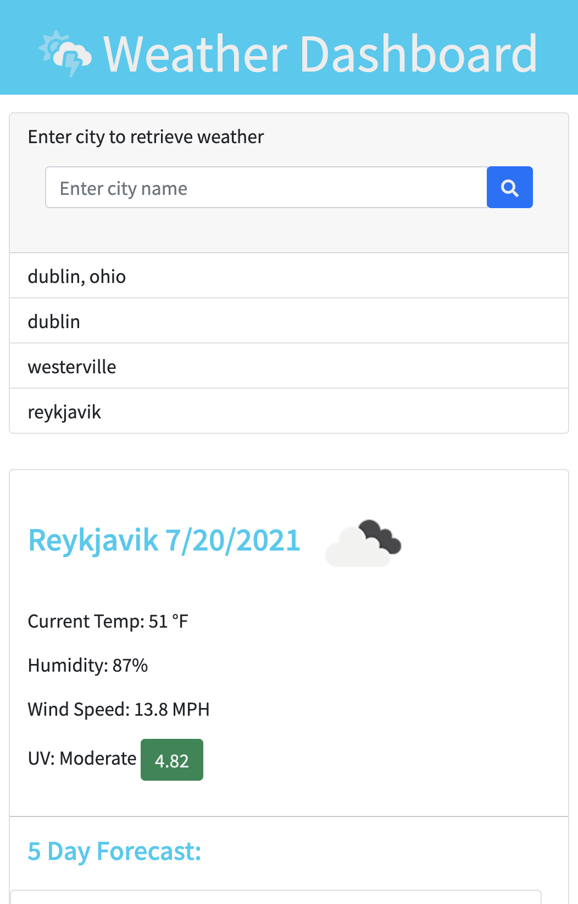

# 06 Server-Side APIs: Weather Dashboard

## About this project

Third-party APIs allow developers to access their data and functionality by making requests with specific parameters to a URL. Developers are often tasked with retrieving data from another application's API and using it in the context of their own. 

This weather app runs in the browser and features dynamically updated HTML and CSS.

-- [Deployed to github pages](https://larafoster.github.io/Weather-Dashboard/) 
-- [Github Repo](https://github.com/larafoster/Weather-Dashboard) 

## Mock-Up

The following images shows the web application's appearance and functionality. The first image is desktop view and the second image is mobile view.

![The weather app includes a search option, a list of cities, and a five-day forecast and current weather conditions for Columbus, Ohio.]

## Languages 

* HTML
* CSS
* JavaScript

## Third Party APIs

* Bootstrap
* jQuery
* Openweathermap 

### Purpose
This app is project 4 in OSU Full Stack Bootcamp.
It is intended for educational purposes only.